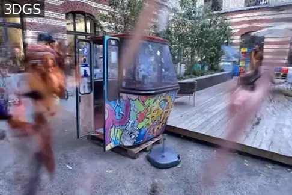

<p align="center">
<h1 align="center">&nbsp;WildGaussians: 3D Gaussian Splatting in the Wild</h1>
  <p align="center">
    <a href="https://jkulhanek.com/">Jonas Kulhanek</a>
    ·
    <a href="https://pengsongyou.github.io/">Songyou Peng</a>
    ·
    <a href="https://cmp.felk.cvut.cz/~kukelova/">Zuzana Kukelova</a>
    ·
    <a href="https://people.inf.ethz.ch/marc.pollefeys/">Marc Pollefeys</a>
    ·
    <a href="https://tsattler.github.io/">Torsten Sattler</a>
  </p>
  <h3 align="center"><a href="https://arxiv.org/pdf/2407.08447">📄 Paper</a> | <a href="https://wild-gaussians.github.io/">🌐 Project Page</a></h3>
  <div align="center"></div>
</p>
<br/>
<p align="center">
  
  
</p>
<p align="justify">
We introduce WildGaussians, a novel approach to handle occlusions and appearance changes with 3DGS.
By leveraging robust DINO features and integrating an appearance modeling module within 3DGS, our method achieves state-of-the-art results.
We demonstrate that WildGaussians matches the real-time rendering speed of 3DGS while surpassing both 3DGS and NeRF baselines in handling in-the-wild data, all within a simple architectural framework.
</p>
<br>

> <b>:dizzy:	NEWS: WildGaussians is now integrated into <a href="https://nerfbaselines.github.io">NerfBaselines</a>. Checkout the results here: https://nerfbaselines.github.io/phototourism</b>


## Installation
We offer two ways to install the method: local installation (through a conda environment) and installation from [NerfBaselines](https://nerfbaselines.github.io), where multiple backends (conda,docker,apptainer) can be selected.

### Use NerfBaselines
WildGaussians is already included in the newest release of [NerfBaselines](https://nerfbaselines.github.io).
If you don't have NerfBaselines installed, you can install it by running:
```bash
conda create -n nb python=3.11
conda activate nb
pip install nerfbaselines>=1.2.0
```

### Local installation
Clone the repository and create a `python == 3.11` Anaconda environment with CUDA toolkit 11.8 installed using
```bash
git clone git@github.com:jkulhanek/wild-gaussians.git
cd wild-gaussians

conda create -y -n wg python=3.11
conda activate wg
conda install -y --override-channels -c nvidia/label/cuda-11.8.0 cuda-toolkit
conda env config vars set NERFBASELINES_BACKEND=python
pip install --upgrade pip
pip install -r requirements.txt
pip install nerfbaselines>=1.2.0
pip install -e ./submodules/diff-gaussian-rasterization ./submodules/simple-knn
pip install -e .
```

## Checkpoints, predictions, and data
The checkpoints and predictions are available online at [https://huggingface.co/jkulhanek/wild-gaussians/tree/main](https://huggingface.co/jkulhanek/wild-gaussians/tree/main):
<ul>
<li><a href="https://huggingface.co/jkulhanek/wild-gaussians/resolve/main/phototourism/trevi-fountain.zip?download=true">Photo Tourism/Trevi Fountain</a></li>
<li><a href="https://huggingface.co/jkulhanek/wild-gaussians/resolve/main/phototourism/sacre-coeur.zip?download=true">Photo Tourism/Sacre Coeur</a></li>
<li><a href="https://huggingface.co/jkulhanek/wild-gaussians/resolve/main/phototourism/brandenburg-gate.zip?download=true">Photo Tourism/Brandenburg Gate</a></li>
<br>
<li><a href="https://huggingface.co/jkulhanek/wild-gaussians/resolve/main/nerfonthego-undistorted/fountain.zip?download=true">NeRF On-the-go/Fountain</a></li>
<li><a href="https://huggingface.co/jkulhanek/wild-gaussians/resolve/main/nerfonthego-undistorted/mountain.zip?download=true">NeRF On-the-go/Mountain</a></li>
<li><a href="https://huggingface.co/jkulhanek/wild-gaussians/resolve/main/nerfonthego-undistorted/corner.zip?download=true">NeRF On-the-go/Corner</a></li>
<li><a href="https://huggingface.co/jkulhanek/wild-gaussians/resolve/main/nerfonthego-undistorted/patio.zip?download=true">NeRF On-the-go/Patio</a></li>
<li><a href="https://huggingface.co/jkulhanek/wild-gaussians/resolve/main/nerfonthego-undistorted/spot.zip?download=true">NeRF On-the-go/Spot</a></li>
<li><a href="https://huggingface.co/jkulhanek/wild-gaussians/resolve/main/nerfonthego-undistorted/patio-high.zip?download=true">NeRF On-the-go/Patio High</a></li>
</ul>

In order to train/evaluate on the NeRF On-the-go dataset, please download the undistorted version
from the following link:
[https://huggingface.co/datasets/jkulhanek/nerfonthego-undistorted/tree/main](https://huggingface.co/datasets/jkulhanek/nerfonthego-undistorted/tree/main)

## Interactive viewer
To start the viewer and explore the trained models, run one of the following:
```bash
# Photo Tourism
nerfbaselines viewer --checkpoint https://huggingface.co/jkulhanek/wild-gaussians/resolve/main/phototourism/trevi-fountain.zip/checkpoint --data external://phototourism/trevi-fountain
nerfbaselines viewer --checkpoint https://huggingface.co/jkulhanek/wild-gaussians/resolve/main/phototourism/sacre-coeur.zip/checkpoint --data external://phototourism/sacre-coeur
nerfbaselines viewer --checkpoint https://huggingface.co/jkulhanek/wild-gaussians/resolve/main/phototourism/brandenburg-gate.zip/checkpoint --data external://phototourism/brandenburg-gate

# NeRF on-the-go
# NOTE: Optionally attach `--data {path to data}` to load the dataset (recommended)
nerfbaselines viewer --checkpoint https://huggingface.co/jkulhanek/wild-gaussians/resolve/main/nerfonthego-undistorted/fountain.zip/checkpoint
nerfbaselines viewer --checkpoint https://huggingface.co/jkulhanek/wild-gaussians/resolve/main/nerfonthego-undistorted/mountain.zip/checkpoint
nerfbaselines viewer --checkpoint https://huggingface.co/jkulhanek/wild-gaussians/resolve/main/nerfonthego-undistorted/corner.zip/checkpoint
nerfbaselines viewer --checkpoint https://huggingface.co/jkulhanek/wild-gaussians/resolve/main/nerfonthego-undistorted/patio.zip/checkpoint
nerfbaselines viewer --checkpoint https://huggingface.co/jkulhanek/wild-gaussians/resolve/main/nerfonthego-undistorted/spot.zip/checkpoint
nerfbaselines viewer --checkpoint https://huggingface.co/jkulhanek/wild-gaussians/resolve/main/nerfonthego-undistorted/patio-high.zip/checkpoint
```

## Training
To start the training on the Photo Tourism dataset, run one of following commands:
```bash
# Photo Tourism
nerfbaselines train --method wild-gaussians --data external://phototourism/trevi-fountain
nerfbaselines train --method wild-gaussians --data external://phototourism/sacre-coeur
nerfbaselines train --method wild-gaussians --data external://phototourism/brandenburg-gate

# NeRF on-the-go
nerfbaselines train --method wild-gaussians --data {path to data}
```

The training will also generate output artifacts containing the **test set predictions**, **checkpoint**, and **tensorboard logs**.

## Rendering videos
To render a video on a trajectory (e.g., generated from the interactive viewer), run:
```bash
nerfbaselines render --checkpoint {checkpoint} --trajectory {trajectory file}
```

## Concurrent works
There are several concurrent works that also aim to extend 3DGS to handle in-the-wild data:
<ul>
<li><a href="https://arxiv.org/pdf/2406.10373v1">Wild-GS: Real-Time Novel View Synthesis from Unconstrained Photo Collections</li></a>
<li><a href="https://arxiv.org/pdf/2403.15704">Gaussian in the Wild: 3D Gaussian Splatting for Unconstrained Image Collections</a></li>
<li><a href="https://arxiv.org/pdf/2406.20055">SpotlessSplats: Ignoring Distractors in 3D Gaussian Splatting</a></li>
<li><a href="https://arxiv.org/pdf/2403.10427">SWAG: Splatting in the Wild images with Appearance-conditioned Gaussians</a></li>
<li><a href="https://arxiv.org/pdf/2406.02407">WE-GS: An In-the-wild Efficient 3D Gaussian Representation for Unconstrained Photo Collections</a></li>
</ul>
</p>
</section>

## Acknowledgements
We would like to thank Weining Ren for his help with the NeRF On-the-go dataset and code and Tobias Fischer and Xi Wang for fruitful discussions.
This work was supported by the Czech Science Foundation (GAČR) EXPRO (grant no. 23-07973X)
and by the Ministry of Education, Youth and Sports of the Czech Republic through the e-INFRA CZ (ID:90254). Jonas Kulhanek acknowledges travel support from the European Union’s Horizon 2020 research and innovation programme under ELISE Grant Agreement No 951847.
The renderer is built on [3DGS](https://github.com/graphdeco-inria/gaussian-splatting) and [Mip-Splatting](https://niujinshuchong.github.io/mip-splatting/).
Please follow the license of 3DGS and Mip-Splatting. We thank all the authors for their great work and released code.

## Citation
If you find our code or paper useful, please cite:
```bibtex
@article{kulhanek2024wildgaussians,
  title={WildGaussians: 3D Gaussian Splatting in the Wild},
  author={Kulhanek, Jonas and Peng, Songyou and Kukelova, Zuzana and Pollefeys, Marc and Sattler, Torsten},
  journal={arXiv},
  year={2024}
}
```
